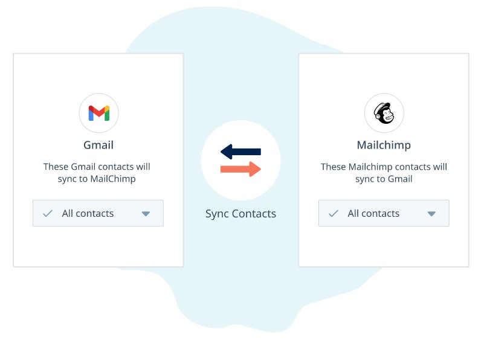

# Gmail and Mailchimp sync app

## 💻 About
### The application was made with:
<span style="color: #42b883">Vue 3</span> framework</br>
<span style="color: #a6cc00">Pinia</span> as state manager</br>
Node 16.15.1


This is an application for Trio's front-end test.
The idea of the project is to create an application where you can sync your contacts from both email providers according to figma. 



So the applications needs basically are:

- [x] Sync your Gmail emails to Mailchimp
- [x] Sync your Mailchimp emails to Gmail
- [x] Sync the two of them making both having all the same emails

## 👩‍💻 Installing the project

- First git clone this project with the following:

```
git clone https://github.com/Tiemine/trio.git
```

- Then go to the project root and run the install command:

```
npm install
```

or

```
yarn install
```

- After that run the following command to run the application:
```
npm run serve
```

## 🔖 Explanations about the code and stack decisions

You can check my stack and code decisions here at my [Technical Design](https://docs.google.com/document/d/1QnpZOG2ntUP7W4NWEBXmiuupxINQHSpYlWKExe8zqYQ/edit?usp=sharing)<br/>
Watch my loom explaining everything in details<br/>
Check the working application deployed at [Amplify](https://main.d2eirndg6hb5t2.amplifyapp.com/)